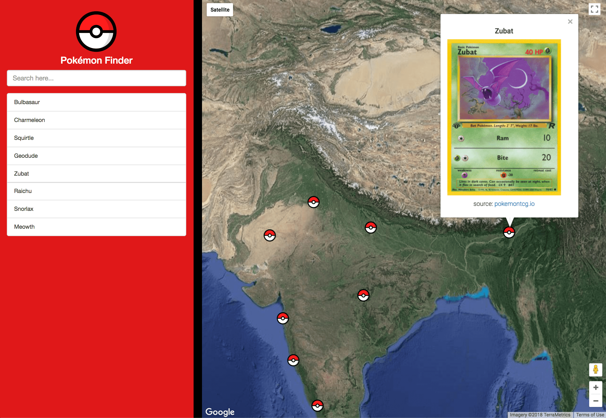

# Pokémon Finder

The objective is to develop a single page application featuring a map of neighborhood.

## How do I run this?

Once you've downloaded this project, open `index.html`. 

## Credits

I've used the following in my project:

- [Pokemon TCG Developer API](https://pokemontcg.io)
- [Pokeball Image](https://commons.wikimedia.org/wiki/File:Pok%C3%A9_Ball_icon.svg)

